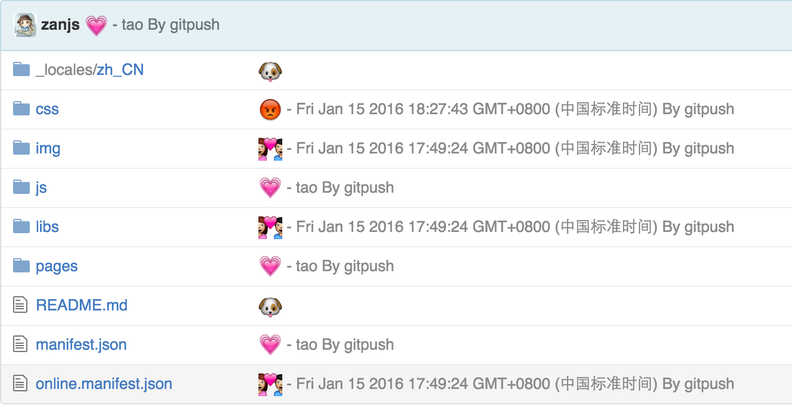
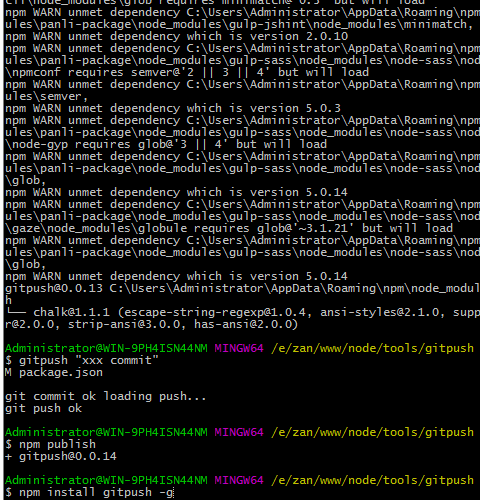

# gitpush

[](https://gitter.im/zanjs/gitpush?utm_source=badge&utm_medium=badge&utm_campaign=pr-badge&utm_content=badge)

[![Build Status][travis-img]][travis]
[![Version][version]](https://github.com/zanjs/gitpush)


Git 命令行实用程序,将所有修改过的文件并提交它们。 git 自动化, commit 添加 emoji 表情

- 自动 git add . or -u -v
- 自动 git commit -m "xxx"
- 自动 git push  

A command line script in nodeJs to perform various Git commands. 
The command gives output of git status, 
followed by git add all new modified files, and then commits them.


## commits show




## help you

还在厌倦 `git add . `， `git commit 'xxx' `, `git push` 

OK? 自从有了 `gitpush` 一切都简单化了 , 提高了工作效率 , 

老板再也不用看我不停的 `git` 提交啦,开心···


fuck  `git add . `， `git commit 'xxx' `, `git push` 

Quick `gitpush` Everything is simplified,Improve work efficiency,


## Installation

```sh
$ npm install gitpush -g
```

## Usage
全局安装 gitpush 后 , 打开您的终端，定位到您的项目根目录

>一定要项目初始化完成后使用哦


After installing the module globally, 
open up your terminal, navigate to the git directory of your choice and type:
```sh
$ gitpush "Your Commit Message"

//or

$ gitpush          \\ Commit is use Time now
```


## gitpush not push

>git push --set-upstream origin gh-pages

设置您默认提交的分支


### Important

命令将输出所有修改的文件，输出与提交, 工作在git 所有环境下

### demo 




### 开发日志

https://github.com/zanjs/gitpush/blob/master/up.md

### Donate


[version]: https://img.shields.io/npm/v/postcss-salad.svg
[travis]:https://travis-ci.org/zanjs/gitpush
[travis-img]:https://travis-ci.org/zanjs/gitpush.svg?branch=master